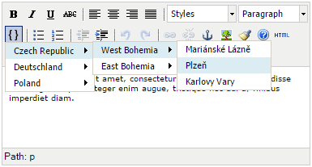

# TinyMCE Simple Snippet plugin
TinyMCE Simple Snippet plugin create simple multi level dropdown menu for inserting custom HTML code or plain text into your text.

This version supports ***TinyMCE 3.x***. TinyMCE 4.x coming soon.

## Screenshot
dropdown **multilevel menu**



## Install
* Copy plugin folder **src/tiny_mce/plugings/snippet** to your TinyMCE folder

## Configuration
- Add `snippet` to param *plugins*
- Define param `snippet_list`
- Insert the button `snippetmenu`
```
        tinyMCE.init({
            mode: "textareas",
            plugins: "snippet",
            snippet_list: snippet_data,
            theme_advanced_buttons2_add_before: "snippetmenu,|"
        });
```
## Data


You must define data source `snippet_data`. Source must be defined before `tinyMCE.init` definition.
* `title` = menu item title
* `value` = HTML or plain text that will be inserted
* `items` = submenu = array of menu items

```
        var snippet_data = [
        {
            title: "Czech Republic",
            value: "",
            items: [
                {
                    title: "West Bohemia",
                    value: "",
                    items: [
                        {
                            title: "Mariánské Láznì",
                            value: "City: Mariánské Láznì"
                        },
                        {
                            title: "Plzeò",
                            value: "City: Plzeò"
                        },
                        {
                            title: "Karlovy Vary",
                            value: "City: Karlovy Vary"
                        }
                    ]
                }]
        }
        ];
```

## Demo

See the demo.

`/demo/index.html`
